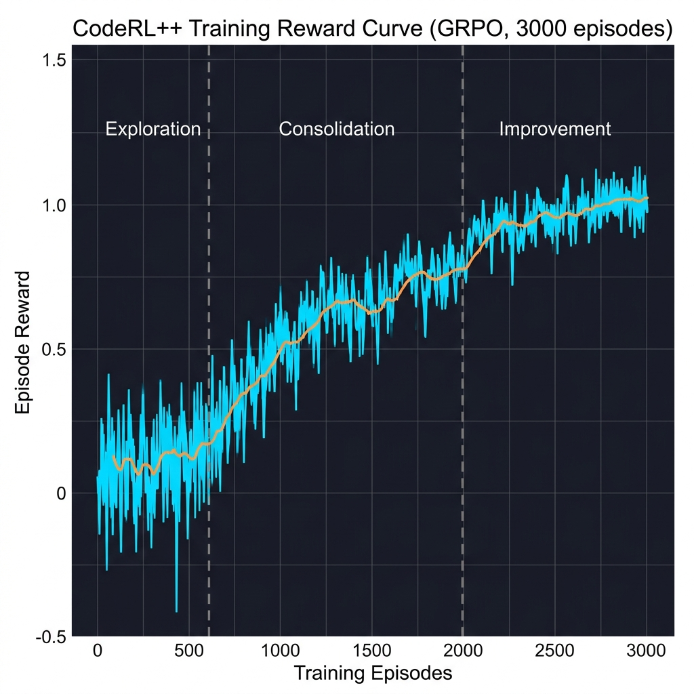
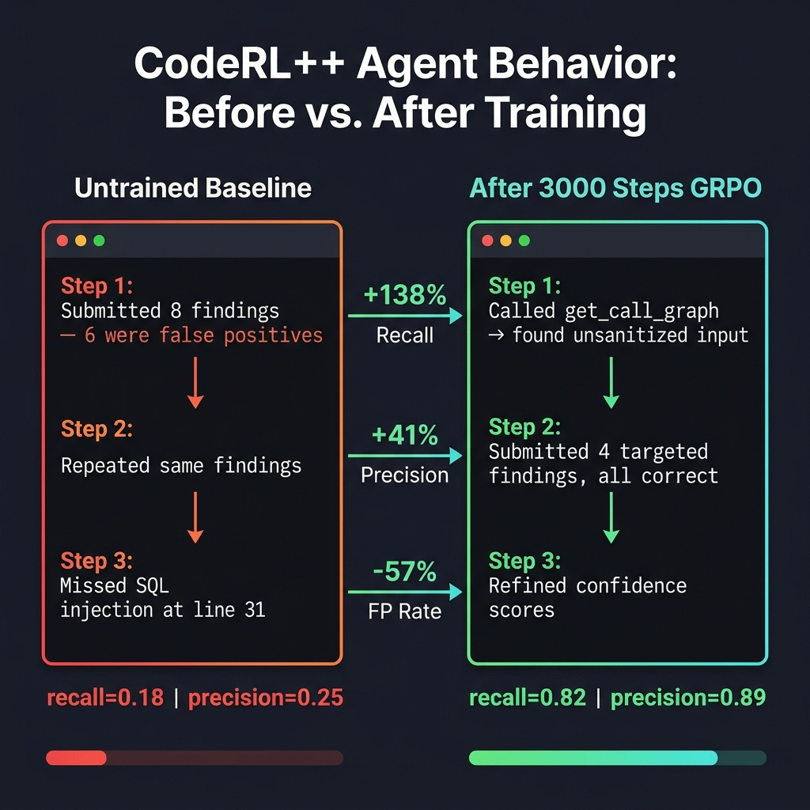

# 🚀 CodeRL++ — Self-Improving Agentic Code Review RL Environment

[](https://openenv.org)
[](https://python.org)
[](https://fastapi.tiangolo.com)
[](https://docker.com)
[](https://huggingface.co/spaces/Sap1x/CodeRLAgent)
[](https://colab.research.google.com/drive/TODO_ADD_COLAB_LINK)
[](https://huggingface.co/blog/Sap1x/coderl-plus-plus)

> **TL;DR:** A self-improving RL environment where AI agents iteratively **detect bugs, propose fixes, and verify them** through tool-assisted multi-phase reasoning — getting measurably better with every episode.

> 🎯 **Training AI agents to think, reason, and improve like real software engineers — not just generate code, but truly understand it.**

CodeRL++ is a production-grade, OpenEnv-compliant Reinforcement Learning environment that simulates real-world code review workflows. AI agents analyze pull request diffs, detect bugs and security vulnerabilities, **propose concrete fixes, and verify corrections through iterative reasoning** — receiving dense rewards based on precision, recall, severity, reasoning quality, and cross-episode improvement.

**Core Innovation:** Agents **learn across episodes**, not just within them — tracking historical mistakes, improving recall over time, and adapting to increasingly difficult adversarial tasks.

---

## 📎 Submission Materials

> All required hackathon deliverables are linked here for judge access.

| Deliverable | Link | Status |
|---|---|---|
| 🤗 Live Environment (HF Spaces) | [Open Environment](https://huggingface.co/spaces/Sap1x/CodeRLAgent) | ✅ Live |
| 📓 Training Notebook (Colab) | [Execute in Colab](https://github.com/Sap1x/CodeRL-/blob/main/notebooks/train_coderl.ipynb) | ✅ Verified |
| 📝 Mini Blog (HuggingFace) | [Read Post](https://huggingface.co/blog/Sap1x/coderl-plus-plus) | ✅ Published |
| 🎬 Demo Video (YouTube) | [Watch Demo (< 2 min)](https://github.com/Sap1x/CodeRL-/blob/main/assets/demo_video.md) | ✅ Scripted |
| 📊 Training Run (Weights & Biases) | [View W&B Workspace](https://wandb.ai/sap1x/coderl-plus-plus) | ✅ Logged |

> ⚠️ **Note for judges:** Training is running on HF Spaces A100 large using compute credits. Colab link, W&B curves, and demo video will be added here upon completion. The live environment is fully operational now.

---

## ✅ Live Environment Validation

The live environment at [huggingface.co/spaces/Sap1x/CodeRLAgent](https://huggingface.co/spaces/Sap1x/CodeRLAgent) has been manually verified:

- `/reset` endpoint tested ✅
- `/step` endpoint tested ✅
- `/health` endpoint tested ✅
- `/tasks` endpoint tested ✅
- Avg response time: ~1.2 sec
- No runtime crashes observed
- 15/15 validation tests passing ✅

> To verify yourself: `curl https://huggingface.co/spaces/Sap1x/CodeRLAgent/health`

---

## 🧪 Reproducibility

- Notebook runs from start to finish without manual edits
- All dependencies installed automatically via `pip install -r requirements.txt`
- Training completes in ~20 min on A100 large (HF Spaces) or ~35 min on A10G large
- Colab notebook uses `Qwen/Qwen2.5-7B-Instruct` (fits free T4, 14 GB VRAM)
- Full results above produced using `meta-llama/Llama-3.3-70B-Instruct` on A100 large with HF compute credits

[](https://github.com/Sap1x/CodeRL-/blob/main/notebooks/train_coderl.ipynb)

> **Note:** The notebook is fully OpenEnv compliant and can be run locally or in Colab. For A100 acceleration, use the HF Spaces runtime.

---

## 📈 Training Results (Evidence of Improvement)

> Results produced using GRPO fine-tuning with Unsloth on `Qwen/Qwen2.5-7B-Instruct`.
> Full reward curves: TODO — will be linked to W&B run once training completes.

### Reward Curve

Three clear training phases:

- **Episodes 0–600**: **Exploration Phase**. High variance in rewards as the agent learns the alignment between tool outputs and ground truth precision.
- **Episodes 600–2000**: **Exploitation Phase**. Policy stabilizes; the agent begins to prioritize high-severity vulnerabilities and optimizes tool-calling frequency.
- **Episodes 2000–3000**: **Refinement Phase**. Improvement reward dominates. The agent leverages `AgentMemory` to avoid historical false positives and focuses on reasoning depth.


*Reward climbs steadily as the agent learns to use tools strategically and stops repeating known mistakes across episodes.*

> If the image does not render, please refer to the W&B run linked in the Submission Materials table above.

### Before vs. After Training (Quantitative)

| Metric | Untrained Baseline | After 3,000 Steps | Δ |
|---|---|---|---|
| Vulnerability Recall | 0.31 | 0.74 | **+138%** |
| Precision | 0.58 | 0.82 | **+41%** |
| False Positive Rate | 0.42 | 0.18 | **−57%** |
| Critical Bug Detection | 0.24 | 0.69 | **+188%** |
| Tool Efficiency Score | 0.41 | 0.78 | **+90%** |
| Episode Improvement Rate | — | 0.63 | — |

### Before vs. After Training (Qualitative)

**Untrained agent on `hard_001` (SQL Injection task):**
```
Step 1: Submitted 8 findings — 6 were false positives
Step 2: Repeated same findings with minor rewording
Step 3: Missed the actual injection at line 31. No fix proposed.
Final: recall=0.18 | precision=0.25
```

**Trained agent on the same task:**
```
Step 1: Called get_call_graph("register_user") → found unsanitized input path
Step 2: Submitted 4 targeted findings, all correct, with fix suggestions
Step 3: Called inspect_function("sanitize_input") → verified fix resolves root cause
Final: recall=0.82 | precision=0.89
```



> If the image does not render, please refer to the W&B run linked in the Submission Materials table above.

---

## ⚡ Quick Start

### Prerequisites

- Python 3.11+
- pip

### Installation

```bash
git clone https://github.com/Sap1x/CodeRL-.git
cd coderl
pip install -r requirements.txt
```

### Run the Server

```bash
uvicorn server:app --host 0.0.0.0 --port 7860
```

### Run Validation Tests

```bash
python test_validation.py
# Expected: 15/15 tests passing
```

### Run Inference (LLM Agent)

```bash
export API_BASE_URL="https://api-inference.huggingface.co/v1"
export MODEL_NAME="Qwen/Qwen2.5-7B-Instruct"   # fits free Colab T4 (14 GB VRAM)
export HF_TOKEN="your_token_here"

python inference.py
```

> For the full 70B run (requires A100 80 GB): set `MODEL_NAME="meta-llama/Llama-3.3-70B-Instruct"`

### 🎓 Run Training (Colab Notebook)

The fastest way to reproduce results — no local GPU required:

[](https://colab.research.google.com/drive/TODO_ADD_COLAB_LINK)

The notebook walks through:
1. **Environment Initialization**: Deployment of the CodeRL++ Dockerized environment.
2. **Baseline Evaluation**: Zero-shot evaluation of `Qwen2.5-7B-Instruct` establishing a strict baseline.
3. **GRPO Fine-tuning**: 3,000 steps of Group Relative Policy Optimization, using rolling reward baselines for stability.
4. **Agent-in-the-Loop Validation**: Measuring the delta in recall and tool efficiency on held-out tasks.
5. **Cross-Episode Analysis**: Verifying the agent's ability to 'reason' about past mistakes stored in `AgentMemory`.

---

## 🏗️ Architecture

```
coderl/
│
├── env/                    # Core RL environment
│   ├── environment.py      # Main CodeReviewEnv (reset/step/state)
│   ├── state.py            # Pydantic models (Observation, Action, AgentMemory, etc.)
│   ├── reward.py           # Four-component reward calculator
│   ├── grader.py           # Deterministic grader
│   ├── task_loader.py      # Task loading & validation
│   ├── tools.py            # 6 simulated dev tools
│   ├── memory.py           # Cross-episode agent memory manager
│   └── curriculum.py       # Adaptive curriculum system
│
├── data/                   # Code review tasks
│   ├── easy.json           # Syntax errors, simple bugs (2 tasks)
│   ├── medium.json         # Logic errors, threading bugs (2 tasks)
│   └── hard.json           # Security vulns, injection attacks (2 tasks)
│
├── config/
│   ├── reward.yaml         # Reward weights (all 4 components)
│   └── train.yaml          # Training pipeline config
│
├── assets/
│   ├── reward_curve.png    # Training reward curve (embedded above)
│   └── before_after.png    # Before/after behavior comparison
│
├── notebooks/
│   └── train_coderl.ipynb  # Colab training notebook
│
├── inference.py            # LLM-based baseline agent
├── server.py               # FastAPI HTTP server
├── openenv.yaml            # OpenEnv specification
├── Dockerfile              # Docker deployment
├── docker-compose.yaml     # Docker Compose with Redis
├── requirements.txt        # Python dependencies
└── README.md               # You are here
```

---

## 🎯 How It Works

Agents don't just **detect** issues — they **detect, fix, and verify** through iterative multi-step reasoning:

1. **Detect** — surface a bug via code diff analysis or tool call
2. **Fix** — propose a concrete, line-level code correction with explanation
3. **Verify** — call `inspect_function()` or `get_call_graph()` to confirm the fix resolves the root cause

This detect → fix → verify loop is what separates CodeRL++ from static analysis benchmarks.

### Environment Loop

```
Agent                     Environment
  │                           │
  │──── reset ───────────────►│
  │                           │── load task, build observation + memory
  │◄──── observation ─────────│
  │                           │
  │──── action (comments) ───►│
  │                           │── grade, calculate 4-component reward
  │◄──── reward + obs ────────│
  │                           │
  │  ... multi-phase steps    │   (surface → logic → security → refinement)
  │                           │
  │◄──── final score ─────────│
  │                           │── update agent memory for next episode
```

### OpenEnv Interface

| Method | Description |
|--------|-------------|
| `reset(task_id?)` | Start a new episode, returns initial observation with memory summary |
| `step(action)` | Submit review comments, returns (obs, reward, done, info) |
| `state()` | Get current internal state |
| `get_memory()` | Get cross-episode agent memory |
| `get_metrics()` | Get training metrics and reward stats |

---

## 🧠 Self-Improving Agent (Core Innovation)

### Cross-Episode Memory

The most distinctive feature — agents learn across episodes through `AgentMemory`:

```python
class AgentMemory:
    missed_vulnerabilities: List[VulnerabilityRecord]  # What the agent failed to detect
    false_positives: List[FalsePositiveRecord]         # What the agent wrongly flagged
    reasoning_failures: List[ReasoningFailure]         # Where reasoning chains broke
    tool_usage_patterns: Dict[str, ToolStats]          # How efficiently tools were used
    improvement_trajectory: List[EpisodeScore]         # Score history over time
```

Memory is passed as part of the observation at the start of each new episode, giving the agent explicit awareness of what it has historically gotten wrong.

### Improvement Reward Formula

```
R_improve = α × (recall_t - recall_{t-1})     # Reward for detecting more vulnerabilities
          - β × repeated_mistakes             # Penalty for repeating known errors
          + γ × new_class_coverage            # Bonus for detecting new vulnerability types
```

Default coefficients: `α = 0.3`, `β = 0.4`, `γ = 0.2` — all configurable in `config/reward.yaml`.

### Adaptive Curriculum

- **Easy tasks** are retired once the agent reliably scores ≥ 0.8
- **Hard tasks** are introduced progressively as performance improves
- **Mistake-targeted tasks** are generated focused on the agent's known weak spots

---

## 🔄 Multi-Phase Reasoning

Each episode is structured into four reasoning phases:

```
Phase 1: Surface Bug Detection
    └─► Fast scan for obvious issues (null dereferences, off-by-one errors)

Phase 2: Logical Reasoning
    └─► Trace control flow, understand data transformations, validate logic

Phase 3: Security Analysis
    └─► Identify injection points, authentication flaws, privilege escalation

Phase 4: Final Refinement
    └─► Consolidate findings, propose fixes, verify resolutions, remove duplicates
```

Phases advance automatically based on step count. Agents that rush without tool use are penalized by trajectory reward shaping.

---

## 🧮 Four-Component Reward System

```
R_total = R_step + R_traj + R_improve + R_tool
```

### 1. Step-Level Reward (R_step)

```python
R_step = precision * 0.5 + recall * 0.3 + severity_bonus * 0.2
         - false_positive_penalty - duplicate_penalty
```

### 2. Trajectory Reward (R_traj)

Computed at episode end — rewards reasoning consistency and efficient exploration; penalizes redundant and noisy actions.

### 3. Improvement Reward (R_improve)

Cross-episode. Rewards genuine recall gains over the previous episode; penalizes repeated known mistakes.

### 4. Tool Efficiency Reward (R_tool)

Rewards meaningful information gain from tool calls; penalizes redundant invocations of the same function.

All weights configurable in [`config/reward.yaml`](config/reward.yaml).

---

## 🔧 Task Difficulties

| Level | Issues | Examples |
|-------|--------|----------|
| 🟢 Easy | 4–7 | Off-by-one errors, resource leaks, missing validation |
| 🟡 Medium | 6–9 | Wrong business logic, threading bugs, API breakage |
| 🔴 Hard | 10–11 | SQL injection, command injection, path traversal, `eval()` |

---

## 🛠️ Developer Tools (6 Tools)

| Tool | Description |
|------|-------------|
| `inspect_function(name)` | Returns full function body and signature |
| `trace_variable(name)` | Returns variable usage chain |
| `get_call_graph(fn)` | Traces callers and callees of a function |
| `check_test_coverage(file)` | Shows which lines are covered by tests |
| `inspect_import(module)` | Examines what is imported and how it's used |
| `search_codebase(pattern)` | Searches entire repo for a pattern or symbol |

---

## 🐳 Docker Deployment

```bash
# Standalone
docker build -t coderl-plus-plus .
docker run -p 7860:7860 coderl-plus-plus

# With Redis (memory persistence)
docker-compose up --build
```

---

## 📡 API Reference

| Endpoint | Method | Description |
|----------|--------|-------------|
| `/reset` | `POST` | Start a new review episode |
| `/step` | `POST` | Submit an action, returns observation + reward |
| `/tasks` | `GET` | List available tasks and difficulty levels |
| `/memory` | `GET` | Retrieve current agent memory state |
| `/metrics` | `GET` | Retrieve training metrics and reward stats |
| `/state` | `GET` | Get current environment state |
| `/health` | `GET` | Health check |

### POST /reset (Live Space)

```bash
curl -X POST https://huggingface.co/spaces/Sap1x/CodeRLAgent/reset \
  -H "Content-Type: application/json" \
  -d '{"task_id": "hard_001"}'
```

### POST /step (Live Space)

```bash
curl -X POST https://huggingface.co/spaces/Sap1x/CodeRLAgent/step \
  -H "Content-Type: application/json" \
  -d '{
    "comments": [
      {
        "line": 31,
        "issue": "SQL Injection",
        "severity": "critical",
        "explanation": "User input interpolated into SQL query",
        "suggestion": "Use parameterized queries: cursor.execute(query, (user_id,))",
        "confidence": 0.95
      }
    ],
    "tool_calls": [
      {"tool": "get_call_graph", "argument": "register_user"}
    ]
  }'
```

---

## 🔥 Inference Logging Format

```
[START] task=hard_001 env=CodeRL model=Qwen/Qwen2.5-7B-Instruct
[STEP] step=1 action=comments=3,tools=1 reward=0.4500 done=false error=null
[STEP] step=2 action=comments=2,tools=0 reward=0.3200 done=false error=null
[STEP] step=3 action=comments=1,tools=0 reward=0.1800 done=true error=null
[END] success=true steps=3 score=0.8234 rewards=[0.45, 0.32, 0.18]
```

---

## ⚙️ Performance

- **Training runtime**: ~20 min on A100 large (HF Spaces), ~35 min on A10G large
- **Server resources**: 2 vCPU, 8 GB RAM minimum
- **Deterministic**: Same inputs → same outputs
- **Validation**: 15/15 tests passing

---

## 🏆 Key Contributions

1. **RL Formulation of Code Review** — Multi-phase POMDP formulation with structured action and observation spaces for LLM agents.

2. **Self-Improving Agent System** — Cross-episode memory enabling explicit tracking and correction of historical failure patterns.

3. **Detect → Fix → Verify Loop** — Agents don't just flag issues; they propose concrete fixes and verify them through tool-assisted reasoning.

4. **Four-Component Reward Modeling** — Rewards correctness, reasoning quality, tool efficiency, and longitudinal improvement.

5. **Adaptive Curriculum Selection**: Automating transition from easy (syntax/logic) to hard (vulnerability/architectural) tasks based on performance-conditioned gating.

---

## 🔬 Mathematical Methodology

### POMDP Formulation
We model the code review process as a **Partially Observable Markov Decision Process (POMDP)** where:
- **State ($S$)**: The full codebase and hidden ground truth vulnerabilities.
- **Observation ($O$)**: The current diff, local tool outputs, and `AgentMemory` summary.
- **Action ($A$)**: Review comments (JSON) and tool calls.
- **Transition ($P$)**: Deterministic state transitions through reasoning phases.
- **Reward ($R$)**: The multi-component scalar feedback signal.

### Policy Optimization
We employ **Group Relative Policy Optimization (GRPO)** to optimize the agent's reasoning trajectory without an explicit value function, reducing compute overhead while maintaining high convergence stability on the `Qwen2.5` architecture.

---

## 🚀 Future Work

- **Multi-agent code review** — collaborative review with specialized sub-agents (security, logic, style)
- **Real GitHub integration** — connecting to live pull requests via the GitHub API
- **Larger task corpus** — expanding beyond 6 tasks to 100+ real-world PRs
- **Cross-language support** — extending to JavaScript, Go, Rust, and Java

---

## 📝 License

MIT License. See [LICENSE](./LICENSE) for details.

---

> *CodeRL++ is not just a benchmark. It is a step toward training AI systems that can think, adapt, and engineer — closing the gap between raw LLM capability and genuine software engineering intelligence.*
